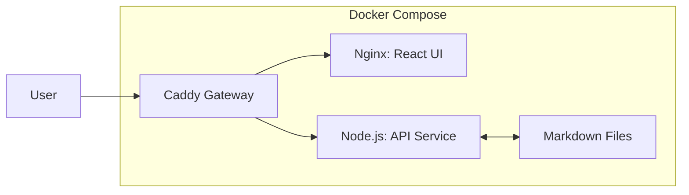

# 永远不要停留在“能用就行”

每一个开发者的旅程，往往都是从“Hello World”跑通的那一刻开始的。

对于这个博客项目，当第一篇文章通过 Github Actions 自动部署到 Github Pages 上，并且在浏览器里成功渲染出来时，那种成就感是真实的。它简单、免费、稳定，对于一个展示型博客来说，Github Pages 几乎是完美的终点。

但作为一名不仅满足于“展示”，更追求“掌控”的开发者，完美往往意味着停滞。

## 静态的边界与痛点

随着文章越来越多，我逐渐触碰到了纯静态站点的“隐形天花板”：

1.  **数据的“本地化”束缚**：
    在静态架构下，博客是“只读”的。浏览器里的 React 代码没有权限修改服务器上的文件。想改一个错别字？我必须打开 VS Code，修改 Markdown，Commit，Push，等待构建。这让“随时随地写作”变成了一种奢望。

2.  **路由的限制**：
    Github Pages 对 SPA (单页应用) 的路由支持并不完美，刷新 404 的问题虽然有 Hack 方案，但总不够优雅。

3.  **功能的缺失**：
    我想做 PWA 离线阅读，想做服务端渲染 (SSR) 优化 SEO，想有一个自己的后台管理系统。这些在纯静态托管下都很难实现。

是时候打破这个舒适区了。

## 缘起：一次“所看”到“所做”的启发

促使我下定决心迈出这一步的，其实是一次偶然的触动。

最近我看了一个关于 **vite-plugin-pwa** 的教程，展示了如何通过简单的配置，将一个普通的网页瞬间转化为 PWA，甚至进一步打包成 Android APK 或 iOS App。那种“网页不再只是网页，而是一个原生级应用”的未来感，深深打动了我。

这让我意识到，Web 的 APP 化不仅是一个技术潮流，更是一种用户体验的升级。

作为一个开发者，我一直信奉 **“所看——所想——所做”** 的闭环思维：
*   **所看**：看到新技术的可能性（PWA, VPS, Docker）。
*   **所想**：思考适合自己项目的架构（不仅仅是套壳，更要有后端的灵魂）。
*   **所做**：动手将架构落地，把想法变成代码。

为了支撑起这个“像 App 一样强大”的梦想，单纯的静态托管显然已经不够了。我需要更强的算力、更自由的控制权——这就是我决定迁移到 VPS 的原动力。

## 迈向 VPS：不仅是换个服务器

将项目迁移到 VPS (Virtual Private Server)，不仅仅是换个地方存文件，而是架构思维的彻底转变。我规划了一套基于 **Docker 容器化** 的现代化架构。

### 1. 核心架构：Docker 微服务编排

我不再把整个项目看作一堆静态文件，而是看作一组协同工作的**服务**。

这个架构带来的改变是本质的：

*   **轻量级后端 (Node.js)**：
    引入一个极简的 Node.js 服务（可能只有几十行代码），专门负责处理文件系统的读写。通过 `fs` 模块，它打通了浏览器与服务器硬盘的隔阂。
*   **文件即数据库**：
    我坚持**不引入 MySQL/MongoDB**。对于博客来说，Markdown 文件本身就是最好的数据库。这保持了系统的极致轻量。

### 2. 网关的选择：Hello, Caddy

在 Nginx 统治的年代，我选择了 **Caddy**。
为什么？因为作为开发者，我更想关注业务，而不是陷入繁琐的配置。Caddy 自动申请和续期 HTTPS 证书的特性，简直是运维的上帝之礼。它将作为整个系统的“大门”，并负责简单的权限验证。

### 3. PWA：像 App 一样流畅

为了追求极致的用户体验，下一步是引入 PWA (Progressive Web App)。
通过 `vite-plugin-pwa`，博客将拥有离线缓存能力。无论是在地铁上还是信号差的地方，用户依然能流畅阅读。这不仅是技术升级，更是对用户体验的尊重。

## 写在最后：挑战作为一种习惯

从技术角度看，现在的静态版本已经足够好用了。为什么还要折腾 VPS、Docker、Caddy？

因为**由简入繁，再化繁为简**，是技术成长的必经之路。

*   **入繁**：学习 Docker 编排，理解反向代理，手动处理 HTTP 协议，编写后端 API。这是对底层原理的探索。
*   **化繁**：利用 Caddy 简化配置，坚持无数据库设计，利用 PWA 优化体验。这是对工程能力的提炼。

这个架构目前还停留在设计图上，但落地的过程，必将是一次精彩的攀登。

Keep coding, keep evolving.
